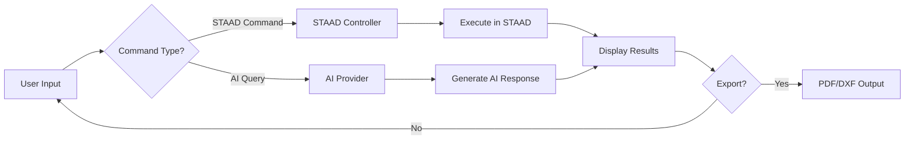

# 🏗️ STAAD GPT

> AI-powered assistant for STAAD.Pro structural engineering workflows

[](https://www.python.org/)
[](LICENSE)
[](https://www.linkedin.com/in/lsdg)

**STAAD GPT** bridges artificial intelligence with STAAD.Pro automation, enabling structural engineers to use natural language commands for complex modeling tasks. Built with Python and featuring an intuitive GUI, it seamlessly integrates AI assistance with direct STAAD.Pro command execution.

*Developed by* **Engr. Lowrence Scott D. Gutierrez**

---

## 🌟 Features

### 🎯 Core Capabilities

- **Natural Language Processing**: Interact with STAAD.Pro using conversational commands
- **AI-Powered Assistance**: Leverages ChatGPT and g4f providers for intelligent responses
- **Direct STAAD Integration**: Execute commands and retrieve model data in real-time
- **Smart Command Parser**: Recognizes node coordinates, beam properties, and file operations
- **Export & Reporting**: Generate PDF reports and DXF drawings automatically

### 🖥️ User Interface

- Clean, modern GUI built with tkinter
- Scrollable conversation history with styled messages
- Custom icons and visual elements for enhanced UX
- Keyboard shortcuts (Enter to send messages)
- Responsive layout adapting to different screen sizes

### 🔧 Technical Features

- Context-aware AI conversations with message history management
- Robust error handling for STAAD and AI operations
- Graceful fallback mechanisms for connectivity issues
- Extensible architecture for future enhancements

---

## 📋 Prerequisites

Before you begin, ensure you have the following:

- **Python 3.8 or higher**
- **STAAD.Pro** (installed and licensed)
- **Active internet connection** (for AI features)

---

## 🚀 Installation

### 1. Clone the Repository

```bash
git clone https://github.com/SC0L0W/STAAD_GPT_v25.1.git
cd STAAD_GPT_v25.1
```

### 2. Install Dependencies

```bash
pip install g4f reportlab ezdxf
```

> **Note**: `tkinter` comes pre-installed with Python on most systems.

### 3. Verify Directory Structure

Ensure your project has the following structure:

```
STAAD_GPT_v25.1/
│
├── main.py
├── core/
│   └── staad_controller.py
├── assets/
│   └── frame0/
│       ├── icon.ico
│       ├── image_1.png
│       ├── image_2.png
│       ├── image_3.png
│       ├── image_4.png
│       ├── image_5.png
│       ├── button_1.png
│       └── button_2.png
└── README.md
```

---

## 💡 Usage

### Starting the Application

```bash
python main.py
```

### Example Commands

The application understands both natural language and specific STAAD commands:

| Command Type | Example |
|-------------|---------|
| Node Information | `"Get coordinates for node 15"` |
| Beam Properties | `"What is the length of beam 23?"` |
| Model Creation | `"Create a new file called bridge_model.std"` |
| AI Assistance | `"Explain load combinations for wind analysis"` |
| General Queries | `"How do I define support conditions?"` |

### GUI Features

- **Text Input**: Type your command or question in the input box
- **Send Button**: Click or press Enter to submit
- **Report Generation**: Use the report button for detailed PDF output
- **Export DXF**: Generate CAD drawings for external use
- **Clear History**: Reset conversation and optionally reconnect to ChatGPT

---

## 🔄 Workflow



---

## 🛠️ Troubleshooting

### Common Issues

| Issue | Solution |
|-------|----------|
| **Missing libraries** | Run `pip install g4f reportlab ezdxf` |
| **STAAD not detected** | Ensure STAAD.Pro is running with an open model |
| **DXF export fails** | Verify `ezdxf` installation: `pip install ezdxf` |
| **AI responses timeout** | Check internet connection; try clearing conversation |
| **Import errors** | Verify Python version is 3.8+ |

### Getting Help

If you encounter issues:

1. Check the [Issues](https://github.com/SC0L0W/STAAD_GPT_v25.1/issues) page
2. Review closed issues for similar problems
3. Open a new issue with detailed error logs

---

## 🗺️ Roadmap

- [ ] Enhanced reinforcement detailing automation
- [ ] Multi-language support for international users
- [ ] Integration with additional structural analysis software
- [ ] Advanced reporting templates
- [ ] Cloud-based model storage
- [ ] Collaborative features for team projects

---

## 🤝 Contributing

Contributions are welcome! To contribute:

1. Fork the repository
2. Create a feature branch (`git checkout -b feature/AmazingFeature`)
3. Commit your changes (`git commit -m 'Add AmazingFeature'`)
4. Push to the branch (`git push origin feature/AmazingFeature`)
5. Open a Pull Request

---

## 📜 License

This project is licensed under the MIT License. See the [LICENSE](LICENSE) file for details.

---

## 👤 Author

**Engr. Lowrence Scott D. Gutierrez**

- LinkedIn: [@lsdg](https://www.linkedin.com/in/lsdg)
- GitHub: [@SC0L0W](https://github.com/SC0L0W)

---

## 🙏 Acknowledgments

- Built with Python, tkinter, g4f, reportlab, and ezdxf
- Inspired by the need to streamline structural engineering workflows
- Thanks to the open-source community for excellent libraries and tools

---

## ⭐ Support

If you find this project helpful, please consider:

- Giving it a star ⭐ on GitHub
- Sharing it with fellow structural engineers
- Contributing to its development

---

<div align="center">

**Made with ❤️ for the structural engineering community**

[Report Bug](https://github.com/SC0L0W/STAAD_GPT_v25.1/issues) · [Request Feature](https://github.com/SC0L0W/STAAD_GPT_v25.1/issues)

</div>
